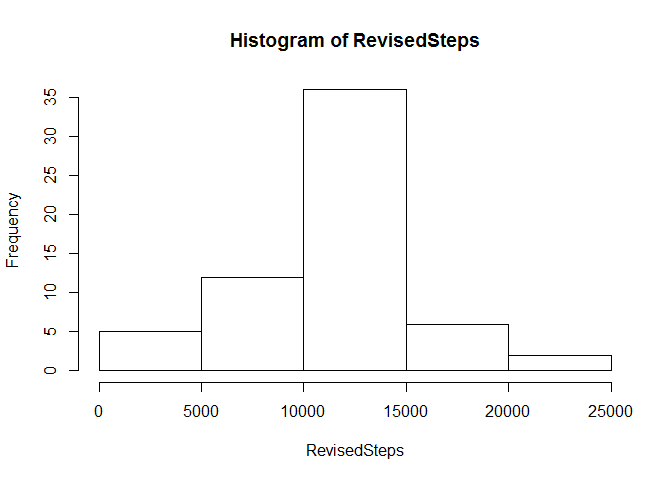
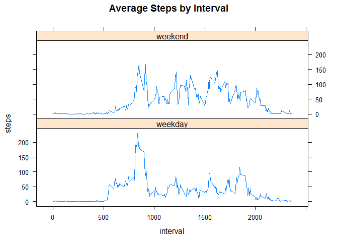

# Reproducible Research: Peer Assessment 1


## Loading and preprocessing the data
Load the data first:


```r
data <- read.csv("activity.csv")
```


## What is mean total number of steps taken per day?
Now, summarize and create a histogram of the number of a strangers steps per day over a two month period, ignoring na values:


```r
sumDate <- aggregate(steps ~ date, data, sum, na.rm = TRUE)
steps <- sumDate$steps
hist(steps)
```

 

The mean number of steps per day is:


```r
mean(steps)
```

```
## [1] 10766.19
```

The median number of steps per day is:

```r
median(steps)
```

```
## [1] 10765
```


## What is the average daily activity pattern?
Now let's look at the average activity pattern calculate the average number of steps per interval, across all days: 

```r
avgInt <-aggregate(steps ~ interval, data, mean, na.rm = TRUE)
```
Here is a time series plot of average steps per interval:

```r
interval <- avgInt$interval
steps <- avgInt$steps
plot(interval, steps, type = "l")
```

 


And the interval with the most steps taken can be calculated:

```r
avgInt[which(avgInt$steps == max(avgInt$steps)),1]
```

```
## [1] 835
```


## Imputing missing values
Next, on to deal with the missing values.
First, a calculation of how many values are missing:

```r
length(which(is.na(data$steps)))
```

```
## [1] 2304
```

I'll use dplyr to replace the missing values in the steps with the mean value of the interval

```r
library(dplyr)
```

```
## 
## Attaching package: 'dplyr'
## 
## The following object is masked from 'package:stats':
## 
##     filter
## 
## The following objects are masked from 'package:base':
## 
##     intersect, setdiff, setequal, union
```

```r
newdata <-data %>%
  group_by(interval) %>%
  mutate(steps = replace(steps, is.na(steps),mean(steps, na.rm = TRUE)))
```
And, now create a histogram of this new dataset with the missing values filled in:

```r
sumDateRevised <- aggregate(steps ~ date, newdata, sum)
RevisedSteps <- sumDateRevised$steps
hist(RevisedSteps)
```

 

The mean of the new dataset is:

```r
mean(RevisedSteps)
```

```
## [1] 10766.19
```
And the median of the new dataset is:

```r
median(RevisedSteps)
```

```
## [1] 10766.19
```

The mean stays the same as it was in the dataset with the na values, but the median changes, to become the same value as the mean.


## Are there differences in activity patterns between weekdays and weekends?
Now to create a new factor for weekend or weekday:


```r
a <-c("Saturday","Sunday")
lastdata <-mutate(newdata, whatday= ifelse(weekdays(as.Date(date)) %in% a, "weekend", "weekday"))
print(head(lastdata))
```

```
## Source: local data frame [6 x 4]
## Groups: interval
## 
##       steps       date interval whatday
## 1 1.7169811 2012-10-01        0 weekday
## 2 0.3396226 2012-10-01        5 weekday
## 3 0.1320755 2012-10-01       10 weekday
## 4 0.1509434 2012-10-01       15 weekday
## 5 0.0754717 2012-10-01       20 weekday
## 6 2.0943396 2012-10-01       25 weekday
```

The time series plot averaged across weekdays or weekends:

```r
avgSteps <-aggregate(steps ~ interval + whatday, lastdata, mean)
print(head(avgSteps))
```

```
##   interval whatday      steps
## 1        0 weekday 2.25115304
## 2        5 weekday 0.44528302
## 3       10 weekday 0.17316562
## 4       15 weekday 0.19790356
## 5       20 weekday 0.09895178
## 6       25 weekday 1.59035639
```

```r
library(lattice)
xyplot(steps ~ interval|whatday, data = avgSteps, type = "l",layout = c(1, 2),main = "Average Steps by Interval")
```

 
This shows a difference for activity over weekends versus weekdays (it peaks at an early interval on the weekdays, and is spread out on the weekend)
